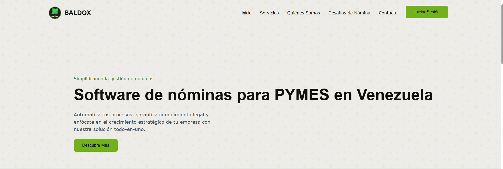

# Landing Page - Proyecto INGENIERÍA DEL SOFTWARE

Este proyecto es una **landing page** desarrollada en el marco de la materia *Ingeniería del Software*. La aplicación cuenta con páginas de inicio, registro y lógica básica de front-end y back-end, usando **Tailwind CSS** y una estructura modular para facilitar el mantenimiento y escalabilidad.

## Imagen del proyecto
-


## Estructura del proyecto
```
LANDING/
├── css/
│   ├── modal.css
│   ├── style.css
│   └── tailwind.css
├── img/
│   ├── BALDOX LOGO.jpg
│   ├── Guillermo.jpg
│   ├── LANDING.PNG
│   └── Victor.png
├── js/
│   ├── app.js
│   ├── landing.js
│   └── modal.js
├── php/
│   ├── libs/
│   ├── comprobacion_clave_temp.php
│   └── registrar.php
├── vendor/
├── composer.json
├── composer.lock
├── .gitignore
├── index.html
└── README.md
```

## Descripción de archivos relevantes

- **index.html**: Página principal de la landing.
- **css/**
  - `modal.css`: Estilos específicos para modales.
  - `style.css`: Estilos personalizados generales.
  - `tailwind.css`: Estilos generados por Tailwind CSS.
- **img/**
  - `BALDOX LOGO.jpg`: Logo principal de la landing.
  - `Guillermo.jpg`, `Victor.png`: Recursos gráficos de autores/colaboradores.
  - `LANDING.PNG`: Captura referencial del proyecto.
- **js/**
  - `app.js`: Lógica general de la aplicación.
  - `landing.js`: Funcionalidad específica de la página principal.
  - `modal.js`: Lógica asociada a ventanas modales.
- **php/**
  - `comprobacion_clave_temp.php`: Lógica de backend para comprobación de claves temporales.
  - `registrar.php`: Registro y validación de nuevos usuarios.
  - `libs/`: Carpeta destinada a librerías PHP reutilizables.
- **.gitignore**: Archivos y carpetas ignoradas por git.
- **README.md**: Documentación principal del proyecto.

## Instalación y uso

1. Clona el repositorio:
   ```bash
   git clone https://github.com/VictorContr/Landing-Page-ING.git
   ```
2. Abre la carpeta `LANDING` en tu editor de código preferido.

3. **Configura el archivo `.env`:**  
   Debes crear un archivo `.env` en la raíz de la carpeta `LANDING` con las variables de entorno necesarias para la conexión a la base de datos y el correo. Ejemplo:
   ```
   DB_HOST=localhost
   DB_NAME=dbcrud_electron_vc_ga
   DB_USER=root
   DB_PASS=tu_contraseña si tienes
   MAIL_USERNAME=tu_correo@gmail.com
   MAIL_PASSWORD=tu_contraseña
   ```

4. **Instala las librerías PHP necesarias:**  
   Ve a la carpeta `php` y ejecuta:
   ```bash
   cd php/libs
   composer install
   ```
   Esto instalará PHPMailer y Dotenv (debes tener [Composer](https://getcomposer.org/) instalado).

5. Accede a `index.html` con tu navegador para visualizar la landing page.

6. Si deseas probar la funcionalidad PHP, asegúrate de levantar un servidor local que soporte PHP (por ejemplo, XAMPP, MAMP o similar) y sitúa la carpeta en el directorio del servidor local.


## Créditos

- **Victor Contreras**
- **Guillermo Alvarez**
- Materia: Ingeniería del Software